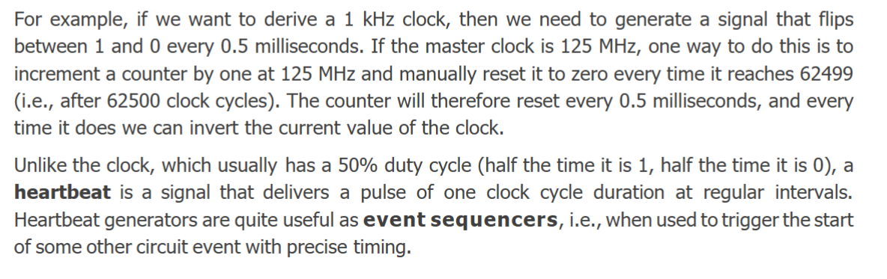
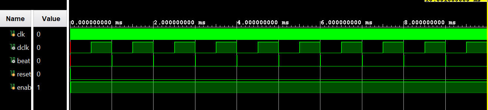
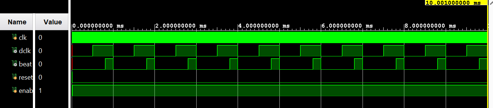

# Lab 2

## Task 1


```
module full_adder(
    input wire X,
    input wire Y,
    input wire Cin,
    output wire Z,
    output wire Cout
    );
    
    assign Z = X ^ Y ^ Cin;
    assign Cout = (X & Y) | (Y & Cin) | (X & Cin);
endmodule
```

```
set_property PACKAGE_PIN T16 [get_ports X]
set_property IOSTANDARD LVCMOS33 [get_ports X]

set_property PACKAGE_PIN W13 [get_ports Y]
set_property IOSTANDARD LVCMOS33 [get_ports Y]

set_property PACKAGE_PIN P15 [get_ports Cin]
set_property IOSTANDARD LVCMOS33 [get_ports Cin]

set_property PACKAGE_PIN D18 [get_ports Z]
set_property IOSTANDARD LVCMOS33 [get_ports Z]

set_property PACKAGE_PIN G14 [get_ports Cout]
set_property IOSTANDARD LVCMOS33 [get_ports Cout]
```

## Task 2

```
module overflowCounter(
    input wire clk, reset, enable,
    output wire [3:0] led
);
    reg [28:0] counter;
    always @(posedge clk) begin
        if (reset == 1'b1) begin
            counter <= 29'd0;
        end
        else if (enable == 1'b1) begin
            counter <=  counter + 1'b1;
        end
        else begin
            counter <= counter;
        end
    end
    assign led = counter[28:25];
endmodule
```


simplified code:
```
module overflowCounter(
    input wire clk, reset, enable,
    output wire [3:0] led
);
    reg [28:0] counter;
    always @(posedge clk) begin
        if (reset == 1'b1)counter <= 29'd0;
        else if (enable == 1'b1) counter <=  counter + 1'b1;
        else counter <= counter;
    end
    assign led = counter[28:25];
endmodule
```

constraints

```
set_property -dict { PACKAGE_PIN M14   IOSTANDARD LVCMOS33 } [get_ports { led[0] }]; #IO_L23P_T3_35 Sch=led[0]
set_property -dict { PACKAGE_PIN M15   IOSTANDARD LVCMOS33 } [get_ports { led[1] }]; #IO_L23N_T3_35 Sch=led[1]
set_property -dict { PACKAGE_PIN G14   IOSTANDARD LVCMOS33 } [get_ports { led[2] }]; #IO_0_35 Sch=led[2]
set_property -dict { PACKAGE_PIN D18   IOSTANDARD LVCMOS33 } [get_ports { led[3] }]; #IO_L3N_T0_DQS_AD1N_35 Sch=led[3]

set_property -dict { PACKAGE_PIN K17 IOSTANDARD LVCMOS33 } [get_ports {clk}];
create_clock -add -period 8.00 [get_ports {clk}];

set_property -dict { PACKAGE_PIN K18   IOSTANDARD LVCMOS33 } [get_ports { reset }];
set_property -dict { PACKAGE_PIN G15   IOSTANDARD LVCMOS33 } [get_ports { enable }];
```

## Task 3

So, if we want to derive a 1 kHz clock from the 125 MHz master clock, how big must the overflow
counter be? Use the equation:
$$f_{div} = f_{clk} / 2^n$$

thus
$$n = \log_2(f_{clk} / f_{div}) = \log_2(125E6 / 1E3) = 16.93$$


```
module overflowClockDivider (
    input wire clk,
    input wire reset,
    input wire enable,
    output wire dividedClk
);
    reg [16:0] counter;
    always @(posedge clk) begin
        if (reset == 1'b1) counter <= 17'd0;
        else if (enable == 1'b1) counter <= counter + 1'b1;
    end
    assign dividedClk = counter[16];
endmodule
```

Note a period of slightly longer than 1ms (1/1kHz) since we need to use a 17 bit counter


Now for 1Hz

$$n = \log_2(f_{clk} / f_{div}) = \log_2(125E6 / 1E1) = 26.897$$

Thus we get 0.9313225746154785 Hz for a 27 bit counter

```

module overflowClockDivider (
    input wire clk,
    input wire reset,
    input wire enable,
    output wire dividedClk
);
    reg [26:0] counter;
    always @(posedge clk) begin
        if (reset == 1'b1) counter <= 27'd0;
        else if (enable == 1'b1) counter <= counter + 1'b1;
    end
    assign dividedClk = counter[26];
endmodule
```


```
set_property PACKAGE_PIN D18 [get_ports dividedClk]
set_property IOSTANDARD LVCMOS33 [get_ports dividedClk]


set_property -dict { PACKAGE_PIN K17 IOSTANDARD LVCMOS33 } [get_ports {clk}];
create_clock -add -period 8.00 [get_ports {clk}];

set_property -dict { PACKAGE_PIN K18   IOSTANDARD LVCMOS33 } [get_ports { reset }];
set_property -dict { PACKAGE_PIN G15   IOSTANDARD LVCMOS33 } [get_ports { enable }];
```

## Task 4



```
module clockDividerHB #(parameter integer THRESHOLD = 62_500_000)(
    input wire clk,
    input wire reset,
    input wire enable,
    output reg dividedClk,
    output wire beat
);
    reg [31:0] counter;
    
    always @(posedge clk) begin
        if (reset==1'b1 || counter >= THRESHOLD-1) counter <= 32'd0;
        else if (enable == 1'b1) counter <= counter + 1'b1;
    end
    
    always @(posedge clk) begin
        if (reset == 1'b1) dividedClk <= 1'b0;
        else if (counter >= THRESHOLD-1) dividedClk <= ~dividedClk;
    end
    
    assign beat=(counter==THRESHOLD-1)&(dividedClk);
    
    
endmodule
```



```


module clockDividerHB #(
parameter integer THRESHOLD = 62_500_000,
parameter integer ON_TIME = 25_000_000
)(
    input wire clk,
    input wire reset,
    input wire enable,
    output reg dividedClk,
    output wire beat
);
    reg [31:0] counter;
    
    always @(posedge clk) begin
        if (reset==1'b1 || counter >= THRESHOLD-1) counter <= 32'd0;
        else if (enable == 1'b1) counter <= counter + 1'b1;
    end
    
    always @(posedge clk) begin
        if (reset == 1'b1) dividedClk <= 1'b0;
        else if (counter >= THRESHOLD-1) dividedClk <= ~dividedClk;
    end
    
    assign beat=(counter>=THRESHOLD-ON_TIME)&(counter<=THRESHOLD-1)&(dividedClk);
    
endmodule
```




```
#set_property -dict { PACKAGE_PIN M14   IOSTANDARD LVCMOS33 } [get_ports { dividedClk }]; #IO_L23P_T3_35 Sch=led[0]
#set_property -dict { PACKAGE_PIN M15   IOSTANDARD LVCMOS33 } [get_ports { beat }]; #IO_L23N_T3_35 Sch=led[1]                                                                                                         


##Pmod Header JE                                                                                                                  
set_property -dict { PACKAGE_PIN V12   IOSTANDARD LVCMOS33 } [get_ports { dividedClk }]; #IO_L4P_T0_34 Sch=je[1]		
# Pin 1				 
#set_property -dict { PACKAGE_PIN W16   IOSTANDARD LVCMOS33 } [get_ports { je[1] }]; #IO_L18N_T2_34 Sch=je[2]                     
#set_property -dict { PACKAGE_PIN J15   IOSTANDARD LVCMOS33 } [get_ports { je[2] }]; #IO_25_35 Sch=je[3]                          
#set_property -dict { PACKAGE_PIN H15   IOSTANDARD LVCMOS33 } [get_ports { je[3] }]; #IO_L19P_T3_35 Sch=je[4]                     
# Pin 7
set_property -dict { PACKAGE_PIN V13   IOSTANDARD LVCMOS33 } [get_ports { beat }]; #IO_L3N_T0_DQS_34 Sch=je[7]                  
#set_property -dict { PACKAGE_PIN U17   IOSTANDARD LVCMOS33 } [get_ports { je[5] }]; #IO_L9N_T1_DQS_34 Sch=je[8]                  
#set_property -dict { PACKAGE_PIN T17   IOSTANDARD LVCMOS33 } [get_ports { je[6] }]; #IO_L20P_T3_34 Sch=je[9]                     
#set_property -dict { PACKAGE_PIN Y17   IOSTANDARD LVCMOS33 } [get_ports { je[7] }]; #IO_L7N_T1_34 Sch=je[10]  
                  
set_property -dict { PACKAGE_PIN K17 IOSTANDARD LVCMOS33 } [get_ports {clk}];
create_clock -add -period 8.00 [get_ports {clk}];

set_property -dict { PACKAGE_PIN K18   IOSTANDARD LVCMOS33 } [get_ports { reset }];
set_property -dict { PACKAGE_PIN G15   IOSTANDARD LVCMOS33 } [get_ports { enable }];
```