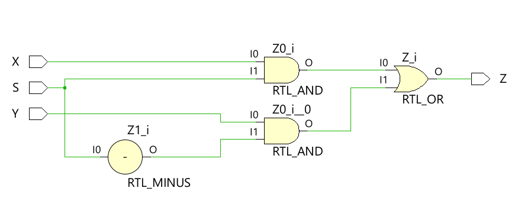
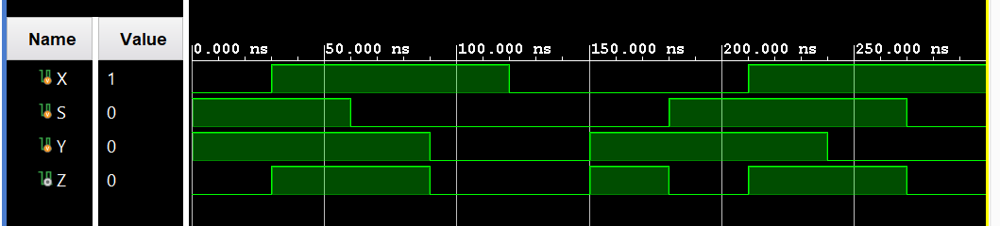
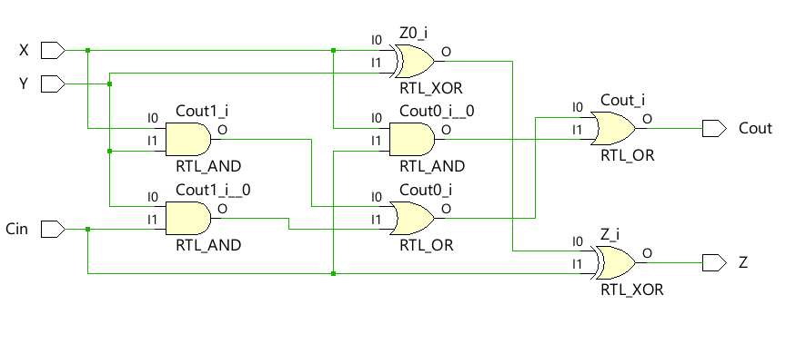
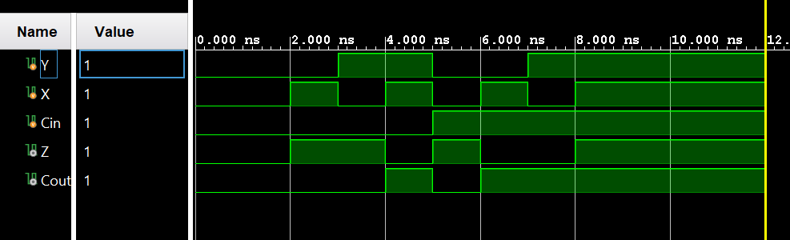
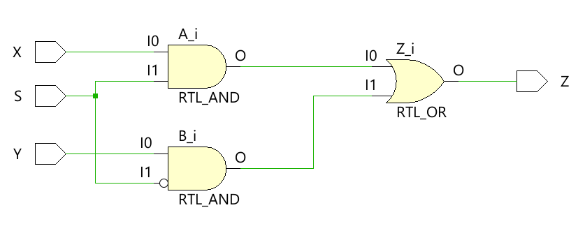
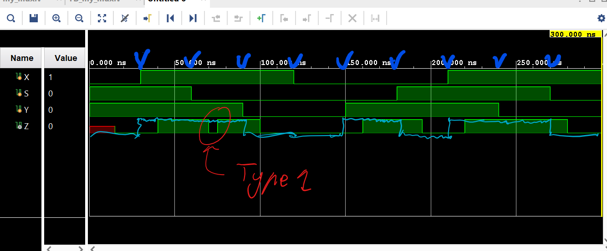
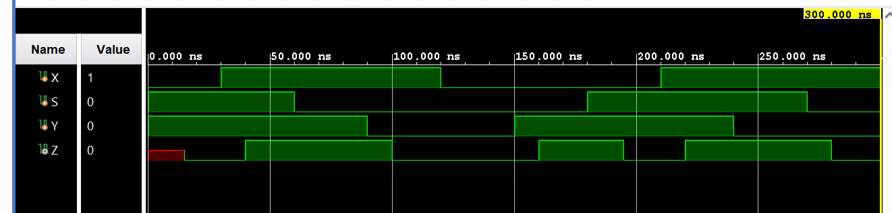

# ENGN4213_verilog_workspace

Workspace for various ENGN4213 Projects

## Activity 1 

### Part 7



## Activity 2 

### Part 1


 ```
Cin\XY | 00 | 01 | 11 | 10
      0 |  0 |  1 |  0 |  1 
      1 |  1 |  0 |  1 |  0

 ```

 $$
Z = X\oplus Y\oplus C_{in}
 $$


 ```
Cin\XY | 00 | 01 | 11 | 10
      0 |  0 |  0 |  1 |  0 
      1 |  0 |  1 |  1 |  1

 ```

 $$
Z_{out} = XY + YC_{in} + X C_{in}
 $$








## Activity 3







### Part 6
15ns

### Part 8
$$
Z = YS' + XY + XS
$$

